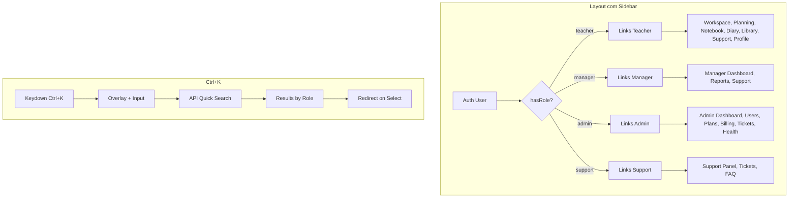

# Plano Fase 7 — Governança, Suporte e Central do Professor

## Contexto técnico mapeado

- **Rotas atuais:** Admin e Support usam arquivos globais [routes/admin.php](../../../Users/Administrator/.cursor/plans/routes/admin.php) e [routes/support.php](../../../Users/Administrator/.cursor/plans/routes/support.php), carregados em [bootstrap/app.php](../../../Users/Administrator/.cursor/plans/bootstrap/app.php). Prefixos `admin` e `support` com middleware `role:admin` e `role:support`. Views em `resources/views/panels/` (admin, admin-subscriptions, support, support-subscription).
- **Módulos:** [Modules/Admin](../../../Users/Administrator/.cursor/plans/Modules/Admin), [Modules/Support](../../../Users/Administrator/.cursor/plans/Modules/Support), [Modules/Teacher](../../../Users/Administrator/.cursor/plans/Modules/Teacher) existem com ServiceProviders e rotas próprias (ex.: Admin tem `Route::resource('admins', ...)` sem prefixo de painel). Os painéis **não** usam hoje os controllers/views dos módulos.
- **Perfil:** [resources/views/profile/edit.blade.php](../../../Users/Administrator/.cursor/plans/resources/views/profile/edit.blade.php) e [ProfileController](../../../Users/Administrator/.cursor/plans/app/Http/Controllers/ProfileController.php) já centralizam logo, assinatura e `hourly_rate` (User já tem esses campos). Rota `/profile` em [routes/web.php](../../../Users/Administrator/.cursor/plans/routes/web.php).
- **Layout:** [resources/views/components/layouts/app.blade.php](../../../Users/Administrator/.cursor/plans/resources/views/components/layouts/app.blade.php) é o layout base (sem sidebar). Workspace usa `<x-workspace::layouts.master>` que apenas envolve com `<x-layouts.app>`. Navegação atual está embutida nas views (ex.: links no dashboard do Workspace), não em um sidebar global.
- **Auditoria:** [Modules/Core/app/Traits/Auditable.php](../../../Users/Administrator/.cursor/plans/Modules/Core/app/Traits/Auditable.php) preenche `created_by`, `updated_by`, `deleted_by` em modelos. Não existe tabela `audit_log`; “audit” no Admin pode ser “atividade recente” a partir desses campos ou uma tabela de log opcional.
- **Billing:** Plan (limits, features), Subscription (user*id, plan_id, status, current_period*), User::plan(), User::subscription(). MRR = soma de `plan.price_monthly` das assinaturas ativas (status trialing/active).
- **Roles:** Spatie Permission; middleware `role:admin`, `role:teacher`, `role:support`. Não há rota específica `manager` ainda; User tem `managedSchools()`.

---

## Task 1: Module Admin — Command Center (B2B/SaaS Ops)

### 1.1 Escopo e localização

- **Opção A (recomendada):** Manter rotas em `routes/admin.php` (já com prefixo e role) e passar a usar **controllers e views do módulo Admin**. Assim o ServiceProvider do Admin já está ativo (config modules) e só precisamos deixar de usar as closures e apontar para `Modules\Admin\Http\Controllers\`.
- **Opção B:** Mover toda a lógica para dentro do módulo Admin e registrar no `RouteServiceProvider` do Admin as rotas com `prefix('admin')->middleware(['auth','verified','role:admin'])`, e remover o carregamento de `routes/admin.php` em `bootstrap/app.php` (ou deixar um include que delega ao módulo).

Implementação sugerida: **Opção A** — controllers no módulo, rotas no `routes/admin.php` apontando para esses controllers.

### 1.2 Dashboard com métricas SaaS (com cache)

- **Controller:** `Modules\Admin\Http\Controllers\AdminDashboardController` (ou estender o atual [AdminController](../../../Users/Administrator/.cursor/plans/Modules/Admin/app/Http/Controllers/AdminController.php)).
- **Métricas (cache 5–15 min):**
  - **Professores ativos:** `User::role('teacher')->count()` (ou usuários com último login nos últimos 90 dias, conforme definição).
  - **Escolas totais (B2B):** `School::count()`.
  - **MRR:** `Subscription::active()->with('plan')->get()->sum(fn ($s) => $s->plan ? (float) $s->plan->price_monthly : 0)` (considerar apenas assinaturas mensais; anuais podem ser convertidas em MRR equivalente).
- **View:** Nova view no módulo Admin (ex.: `admin::dashboard`) ou em `resources/views/panels/` com cards “glassmorphism” (Tailwind 4.1), ícones `fa-duotone fa-shield-check` e `fa-duotone fa-chart-mixed`, conforme [GloablsSystem.md](../../../Users/Administrator/.cursor/plans/GloablsSystem.md).

### 1.3 User Management (CRUD + upgrade manual para Pro)

- **CRUD:** Controller `UserManagementController` no Admin: listagem (filtro por role: teacher, etc.), create/edit (campos essenciais), delete (soft delete onde aplicável). Apenas usuários com role teacher (e eventualmente manager); não expor super-admin.
- **Upgrade manual para Pro:** Ação “Tornar Pro” que cria ou atualiza uma `Subscription` para o usuário com plano `pro` (e atualiza `user.membership` se for o padrão do sistema). Usar `Plan::where('key', 'pro')->first()` e `Subscription::updateOrCreate(...)` com status `active` e período.

### 1.4 Plan Manager

- **Interface:** Listar planos (`Plan::ordered()->get()`), editar limites (form para `limits` JSON: `max_schools`, `max_classes`, `ai_plans_per_month`). Persistir em `plans.limits` (já é JSON no model). Controller `PlanManagerController` ou método no mesmo controller do dashboard; view com tabela/form por plano.

### 1.5 System Health (logs + auditoria)

- **Logs:** Leitura das últimas linhas de `storage/logs/laravel.log` (ou canal configurado) em uma view “System Health” (apenas leitura, sem executar código arbitrário). Alternativa: usar Monolog com um handler que escreve em tabela e listar essa tabela.
- **Auditoria:** Como não há tabela `audit_log`, opções: (1) Listar “atividade recente” a partir de modelos Auditable (ex.: últimas atualizações em `schools`, `lesson_plans` com `updated_by` e timestamp); (2) Criar migration `audit_logs` e um observer que registra alterações importantes. Recomendação inicial: (1) com consultas simples e cache curto.

### 1.6 Rotas e views

- Em `routes/admin.php`: rotas nomeadas para dashboard, users (resource ou get/post/put/delete), plans (get/edit, put update), health (get). Todas com prefixo `admin` e middleware `auth`, `verified`, `role:admin`.
- Views: usar componente `<x-icon>` e layout consistente com [GloablsSystem.md](../../../Users/Administrator/.cursor/plans/GloablsSystem.md) (loading, ícones duotone).

---

## Task 2: Module Teacher — Personal Hub (Central do Professor)

### 2.1 Unificar “Configurações de Carreira” e perfil

- **Situação atual:** [profile/edit](../../../Users/Administrator/.cursor/plans/resources/views/profile/edit.blade.php) já contém logo, assinatura e `hourly_rate`. Podem ser reorganizados em abas (ex.: “Marca pessoal” e “Configurações de Carreira”) na mesma página ou em sub-rotas.
- **Proposta:** Manter uma única rota `/profile` (ou `/teacher/profile`) e na view usar abas (Alpine ou Livewire): **Marca pessoal** (logo, assinatura, hourly_rate) e, em seguida, **Notificações**, **Assinatura**, **Segurança**. Assim a “Central do Professor” fica em um só lugar.

### 2.2 Notification preferences

- **Model:** Migration para `user_preferences` ou coluna JSON em `users` (ex.: `notification_preferences`: `{ "weekly_report": true, "attendance_alerts": true }`). Preferência: coluna `users.notification_preferences` (JSON) para não multiplicar tabelas.
- **UI:** Toggles (Livewire ou Alpine) para “Relatório semanal de desempenho”, “Alertas de frequência”, etc. Salvar via `ProfileController` ou `TeacherProfileController` no módulo Teacher.

### 2.3 Subscription overview

- **Dados:** `auth()->user()->plan()`, `auth()->user()->subscription()` (current_period_end, etc.), e créditos de IA restantes (já existe `AiAssistantService::getRemainingLessonPlanGenerations()`).
- **View:** Bloco “Sua assinatura” com plano atual, limite de IA (X de Y usados neste mês), link para o módulo Billing (ex.: `route('billing.index')` para faturas/gerenciar).

### 2.4 Security: senha e 2FA

- **Senha:** Rota e form para alteração de senha (ex.: `profile/password` ou dentro da aba Segurança). Usar `Hash::check` + `User::update(['password' => Hash::make($new)])` com validação de senha atual.
- **2FA:** Laravel Fortify oferece two-factor authentication; adicionar Fortify ao projeto e configurar “Two Factor Authentication” na documentação do Fortify. Alternativa: implementação mínima com TOTP (ex.: pragmarx/google2fa ou similar) e armazenar `user.two_factor_secret` / `user.two_factor_confirmed_at`. Na aba Segurança: botão “Ativar 2FA” que gera secret, exibe QR e pede código para confirmar.

### 2.5 Onde hospedar: app vs módulo Teacher

- **Opção A:** Manter rotas em `web.php` (`/profile`) e estender `ProfileController` e views em `resources/views/profile/` (com abas). Módulo Teacher fica para futuras funcionalidades específicas do professor.
- **Opção B:** Mover perfil para o módulo Teacher: rotas em `routes/teacher.php` ou no módulo Teacher com prefixo (ex.: `/teacher/settings`), controller e views em `Modules/Teacher`. Assim a “Central do Professor” fica toda no módulo.

Recomendação: **Opção A** no curto prazo (menos deslocamento de rotas) com abas no mesmo perfil; depois pode-se migrar para Teacher se quiser isolar por módulo.

---

## Task 3: Module Support — Customer Success

### 3.1 Ticketing system (professor abre ticket)

- **Model:** Migration `support_tickets`: `id`, `user_id`, `subject`, `category` (string ou enum: e.g. billing, ai, import, other), `message` (text), `status` (open, answered, closed), `created_at`, `updated_at`. Opcional: `support_ticket_messages` para réplicas (thread).
- **Livewire:** Componente no módulo Support (ex.: `TicketList`, `CreateTicket`) para o professor: listar seus tickets, abrir novo (subject, category, message). Rotas em `routes/teacher.php` (ex.: `support.tickets.index`, `support.tickets.store`) ou em `routes/support.php` para área do professor — melhor em teacher, pois professor acessa “Meus tickets”.
- **Ícones:** `fa-duotone fa-headset`, `fa-duotone fa-circle-question` nas views do Support.

### 3.2 Admin Support view (resposta a tickets)

- **Admin:** Nova seção no painel Admin (ou no painel Support para role `support`): listar todos os tickets, filtrar por status, abrir detalhe e responder. Se usar apenas uma mensagem por ticket, pode ser um campo `admin_reply` (text) e status “answered”. Se usar thread, `support_ticket_messages` com `user_id` (quem escreveu) e `body`.
- **Rotas:** Em `routes/admin.php` (ex.: `panel.admin.tickets.`_) ou em `routes/support.php` para role `support` (ex.: `panel.support.tickets.`_). Decisão: tickets respondidos por “suporte” (role support) ou por admin; o plano diz “Admin Support View” — pode ser uma view no Admin que lista tickets e permite resposta.

### 3.3 Knowledge Base (FAQ)

- **Conteúdo:** Páginas estáticas ou conteúdo em BD. Opção simples: tabela `faq_entries` (title, slug, body, category, sort) e rotas públicas ou autenticadas `GET /faq`, `GET /faq/{slug}`. Alternativa: views estáticas em `Modules/Support/resources/views/faq/` com artigos “Como gerar planos com IA”, “Como importar alunos”, etc.
- **Acesso:** “Público ou interno” — se interno, colocar atrás de `auth`; se público, link no footer ou em “Ajuda”. Recomendação: seção “Ajuda” acessível após login (link no sidebar) que leva à FAQ.

### 3.4 Registro do módulo e rotas

- Garantir que [Modules/Support/app/Providers/SupportServiceProvider](../../../Users/Administrator/.cursor/plans/Modules/Support/app/Providers/SupportServiceProvider.php) esteja registrado em `config/app.php` (providers) ou que o pacote nwidart carregue os módulos a partir de `modules_statuses.json`. Rotas de tickets do professor podem ficar em `routes/teacher.php` chamando controllers do Support; rotas de resposta no Admin em `routes/admin.php` chamando `Modules\Support\Http\Controllers\AdminTicketController` (ou similar).

---

## Task 4: System Refactor — Sidebar universal e Command Palette (Ctrl+K)

### 4.1 Universal sidebar por role

- **Layout único:** Criar um layout “app com sidebar” (ex.: `resources/views/components/layouts/app-with-sidebar.blade.php` ou dentro de Core) usado por todas as áreas autenticadas (teacher, manager, admin, support).
- **Conteúdo da sidebar:** Baseado em `auth()->user()->roles` (ou `hasRole`):
  - **Teacher:** Workspace, Planning, Notebook, Diary, Library, Support (link para “Meus tickets” ou FAQ), Perfil/Configurações.
  - **Manager:** Manager Dashboard (nova rota se necessário), School Reports, Support.
  - **Admin:** Admin Dashboard, Users, Plans, Billing/Subscriptions, Support Tickets, System Health.
  - **Support:** Link para painel Support (já existe), tickets, FAQ.
- **Onde aplicar:** Trocar as views que hoje usam `<x-layouts.app>` (ou o master do Workspace) para usar o novo layout com sidebar quando o usuário estiver autenticado. O layout do Workspace pode incluir o sidebar e o slot; o mesmo layout pode ser usado pelos painéis admin/support se passarem a usar um “app layout com sidebar” compartilhado.

### 4.2 Quick Search (Ctrl+K)

- **Alpine.js:** Componente global (ex.: `x-data="commandPalette()"`) que escuta `keydown.ctrl.k` (ou `meta.k` no Mac). Ao abrir: overlay + input de busca.
- **Conteúdo da busca:** Dados dinâmicos por role:
  - **Teacher:** Escolas (nome), turmas (nome), alunos (nome) — possivelmente via endpoint JSON (ex.: `GET /api/quick-search?q=...`) que retorna { schools: [], classes: [], students: [] } para o usuário atual. Ao selecionar um item, redirecionar (ex.: turma → `workspace.show`, aluno → `workspace.student.portfolio`).
  - **Admin/Support:** Pode incluir usuários (email/nome) e redirecionar para edição ou perfil.
- **Implementação:** Endpoint Livewire ou Controller JSON; front consome e exibe lista. Teclado: setas para navegar, Enter para selecionar, Escape para fechar. Estilo “command palette” (modal central, lista abaixo do input).

### 4.3 Diagrama de fluxo (sidebar + roles)

---

## Restrições técnicas e boas práticas

- **Isolamento por role:** Manter middleware `role:admin`, `role:teacher`, `role:support` em todas as rotas dos painéis. Se houver role `manager`, criar middleware ou verificar `hasRole('manager')` e rotas prefixadas (ex.: `manager/`).
- **Performance Admin:** Cache para métricas do dashboard (ex.: `Cache::remember('admin.metrics', 600, fn () => [...])`).
- **Audit:** Usar apenas dados já gravados por Auditable onde possível; evitar logging de dados sensíveis em “system health”.
- **UI:** Inter/Poppins, Tailwind 4.1, glassmorphism nos cards do Admin, `<x-icon>` com duotone conforme [GloablsSystem.md](../../../Users/Administrator/.cursor/plans/GloablsSystem.md).

---

## Ordem de implementação sugerida

1. **Task 1 (Admin):** Dashboard com métricas em cache e views no módulo Admin; em seguida User Management (CRUD + upgrade Pro), Plan Manager e System Health. Rotas em `routes/admin.php` apontando para controllers do módulo Admin.
2. **Task 2 (Teacher Hub):** Abas no perfil (Marca pessoal já existe; adicionar Notificações, Assinatura, Segurança); migration e lógica de notification_preferences; bloco de assinatura e créditos IA; senha e 2FA.
3. **Task 3 (Support):** Migration e models para tickets; Livewire para professor criar/ver tickets; view Admin para listar/responder; FAQ (tabela ou views estáticas).
4. **Task 4 (Sidebar + Ctrl+K):** Layout com sidebar dinâmico por role; depois command palette com endpoint de quick search e redirecionamentos.

---

## ServiceProviders e rotas

- **Admin e Support:** Os módulos já estão ativos (providers em `module.json` e registrados pelo nwidart). Não é obrigatório mover as rotas de `routes/admin.php` e `routes/support.php` para dentro dos módulos; basta que os **controllers e views** usados por essas rotas estejam nos módulos. Assim, `routes/admin.php` e `routes/support.php` continuam a ser carregados em `bootstrap/app.php` e passam a referenciar, por exemplo, `Modules\Admin\Http\Controllers\AdminDashboardController` e `Modules\Support\Http\Controllers\AdminTicketController`. Se preferir tudo dentro do módulo, registrar no `RouteServiceProvider` do Admin/Support as rotas com prefixo e middleware e remover (ou reduzir) o conteúdo de `routes/admin.php` e `routes/support.php`.

---

## Resumo de arquivos principais

| Área                                                | Ação                                                                                                                                                            |
| --------------------------------------------------- | --------------------------------------------------------------------------------------------------------------------------------------------------------------- |
| `routes/admin.php`                                  | Apontar para controllers do módulo Admin (dashboard, users, plans, health).                                                                                     |
| `Modules/Admin/Http/Controllers/`                   | AdminDashboardController (métricas em cache), UserManagementController, PlanManagerController, AdminHealthController (ou um único AdminController com métodos). |
| `Modules/Admin/resources/views/`                    | dashboard, users (index/edit), plans (index/edit), health.                                                                                                      |
| `app/Http/Controllers/ProfileController` ou Teacher | Abas: Marca pessoal, Notificações, Assinatura, Segurança.                                                                                                       |
| `users` table                                       | Coluna `notification_preferences` (JSON) opcional.                                                                                                              |
| `Modules/Support`                                   | Migration support_tickets (e opcional support_ticket_messages); Models; Livewire CreateTicket, TicketList; Controller para Admin responder.                     |
| `routes/teacher.php`                                | Rotas para tickets (support.tickets.).                                                                                                                          |
| FAQ                                                 | Tabela faq_entries ou views em Support; rota GET /faq ou /help.                                                                                                 |
| Layout Core ou resources/views                      | Novo layout “app-with-sidebar” com nav por role.                                                                                                                |
| Alpine + API                                        | Command palette (Ctrl+K) e endpoint quick-search.                                                                                                               |

O próximo passo prático é implementar o **Admin Dashboard com métricas em cache** e a **Central do Professor** (perfil com abas e bloco de assinatura), conforme indicado.
